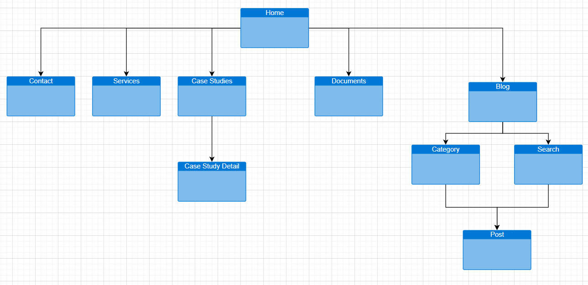

# SONNM

## Overview



## Steps

1. [x] Create a Sitemap
2. [ ] Check the design and choose a proper UI Framework. Such as: TailwindCSS(Atomic CSS Framework), Ant Design(Atomic CSS Framework included built-in ReactJS Components), Material, Bootstrap, Bulma, ...
3. [ ] Create the relevant page routes
4. [ ] Apply code clean standard: seperate UI and business logic
5. [ ] Breakdown design into smaller components: global styles, components
6. [ ] Create page details : collect bricks and build a fully page with fake data
7. [ ] Create page interaction : handle user's interaction : state, form validation,...
8. [ ] Integrate with API : they can be http request, websocket and they can be restful api or graphql. Should write test for your api integration ( use mocks & stubs if needed)
9. [ ] Think about the infrastructure and setup your continuous deployment process
10. [ ] Test your application
11. [ ] Write tests for your application and setup your continous integration process
12. [ ] Create blueprint for developers: overview source code architecture, component usage guidlines, developer's guidelines

## Technical topics

## Cheatsheet

1. The upgrade guide

> Upgrade React version to latest

```bash
yarn add react@latest react-dom@latest
```

> Upgrade next.js version to 12

```bash
yarn add next@12
```

## Adding Typescript

```bash
yarn add -D typescript @types/react @types/node @types/styled-jsx
```

> Error : style jsx global nextjs typescript is not assigned

Just create **custom.d.ts**

```ts
// custom.d.ts
import "react";

declare module "react" {
  interface StyleHTMLAttributes<T> extends React.HTMLAttributes<T> {
    jsx?: boolean;
    global?: boolean;
  }
}
```

### Add routes for sitemap

1. Home -> index.tsx
2. Pages -> [pageSlug].tsx : contact, service's pages
3. Case Studies -> case-studies/index.tsx case-studies/[slug].tsx
4. Documents -> documents/index.tsx documents/[_id].tsx documents/[_id]/download.tsx
5. Blog -> blog/index.tsx /blog/search.tsx blog/[categorySlug].tsx blog/posts/[postSlug].tsx
6. Search -> search/index.tsx

### Defined ServerSideProps
